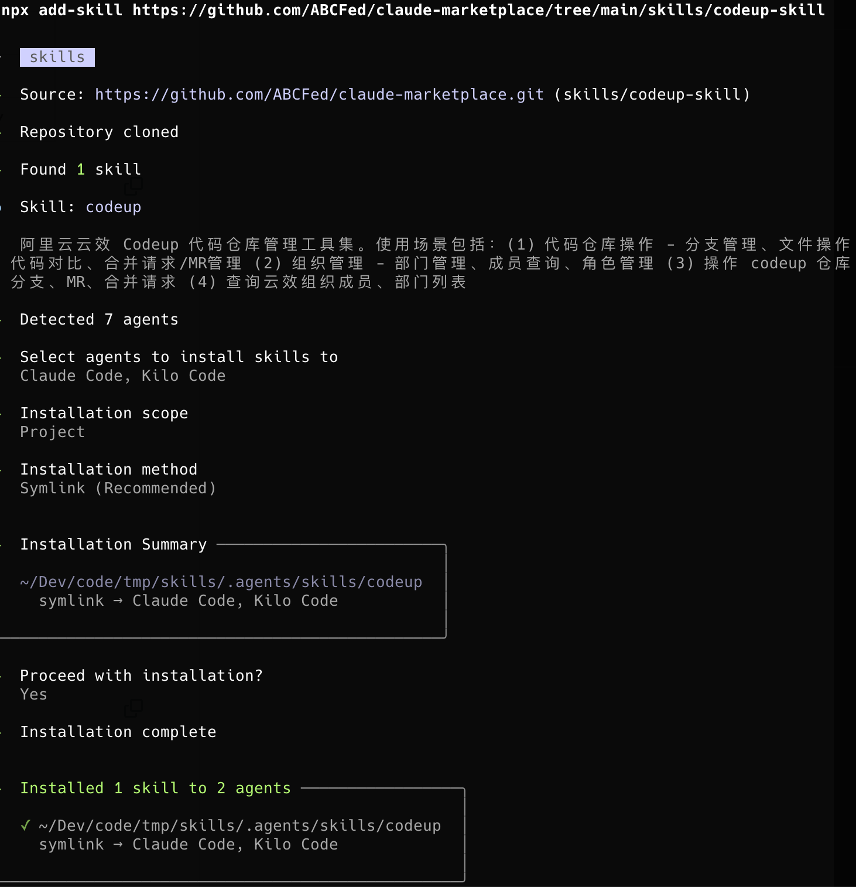

# ABC Claude Code Plugin Marketplace

中文 | [English](./README_EN.md)

本仓库托管了 ABC 团队的 Claude Code 插件市场。

## 快速开始

### 通过 add-skill 安装（适用于所有 AI 代理）



```bash
# 安装单个 skill
npx add-skill https://github.com/ABCFed/claude-marketplace/tree/main/skills/tapd
npx add-skill https://github.com/ABCFed/claude-marketplace/tree/main/skills/apifox
npx add-skill https://github.com/ABCFed/claude-marketplace/tree/main/skills/codeup
npx add-skill https://github.com/ABCFed/claude-marketplace/tree/main/skills/jenkins-deploy
npx add-skill https://github.com/ABCFed/claude-marketplace/tree/main/skills/git-flow
```

**常用选项**：

| 选项 | 说明 |
|------|------|
| `-g, --global` | 安装到用户目录而非项目目录 |
| `-a, --agent <agents...>` | 指定目标 agent（如 claude-code, codex） |
| `-s, --skill <skills...>` | 按名称安装指定 skills（多选用空格分隔） |
| `-l, --list` | 列出可用 skills但不安装 |
| `-y, --yes` | 跳过所有确认提示 |

**示例**：

```bash
# 安装到用户目录
npx add-skill https://github.com/ABCFed/claude-marketplace/tree/main/skills/tapd --global

# 指定 agent 安装
npx add-skill https://github.com/ABCFed/claude-marketplace/tree/main/skills/tapd --agent codex

# 跳过确认提示
npx add-skill https://github.com/ABCFed/claude-marketplace/tree/main/skills/tapd --yes
```

### 通过插件市场安装（仅 Claude Code）

```bash
# 启动 Claude Code
claude

# 添加本地插件市场
/plugin marketplace add https://github.com/ABCFed/claude-marketplace

# 安装 abc-development-plugin
/plugin install abc-development-plugin@abc-claude-plugin-marketplace
```

## 技能详情

### tapd

TAPD 敏捷研发管理平台集成，通过 TAPD API 实现研发全流程管理。

**安装**：
```bash
npx add-skill https://github.com/ABCFed/claude-marketplace/tree/main/skills/tapd
```

**准备**：
```bash
# 编辑 ~/.zshrc 或 ~/.bashrc
export TAPD_ACCESS_TOKEN="your_token_here"
source ~/.zshrc
```

**触发关键词**：TAPD、需求、缺陷、任务、迭代、测试用例、Wiki、工时

**功能特性**：
- 需求管理 - 查询、创建、更新需求
- 缺陷管理 - 管理缺陷生命周期
- 任务管理 - 任务 CRUD 操作
- 迭代管理 - Sprint/迭代管理
- 测试用例 - 测试用例管理
- Wiki 管理 - 创建和更新 Wiki 文档
- 评论和工时 - 管理评论、记录工时
- 关联关系 - 需求与缺陷关联

---

### apifox

ABC 医疗云 API 文档查询工具，读取和查询 ABC API 的 OpenAPI 规范文档（4,000+ 接口）。

**安装**：
```bash
npx add-skill https://github.com/ABCFed/claude-marketplace/tree/main/skills/apifox
```

**准备**：
```bash
# 编辑 ~/.zshrc 或 ~/.bashrc
export APIFOX_ACCESS_TOKEN="your_apifox_token_here"
export APIFOX_PROJECT_ID="4105462"  # 可选，默认为 4105462
source ~/.zshrc
```

**触发关键词**：API、接口、Apifox、OpenAPI、接口文档

**功能特性**：
- 接口查询 - 按路径、方法、模块搜索接口
- 接口详情 - 获取完整定义（自动解析 $ref）
- 统计分析 - 接口总数、模块分布、方法统计
- 文档导出 - 导出 JSON/Markdown 摘要

---

### codeup

阿里云云效 Codeup 代码仓库管理工具集，通过 Codeup API 管理代码仓库、分支、文件和合并请求。

**安装**：
```bash
npx add-skill https://github.com/ABCFed/claude-marketplace/tree/main/skills/codeup
```

**准备**：
```bash
# 编辑 ~/.zshrc 或 ~/.bashrc
export YUNXIAO_ACCESS_TOKEN="your_codeup_token_here"
source ~/.zshrc
```

**触发关键词**：Codeup、代码仓库、分支、MR、合并请求、阿里云、云效

**功能特性**：
- 仓库管理 - 查询仓库详情、列出仓库
- 分支操作 - 创建、删除、列出分支
- 文件操作 - 读取、创建、更新、删除文件，对比代码差异
- MR 管理 - 创建合并请求、添加评论、列出 MR 和补丁集
- 组织管理 - 查询组织、部门、成员、角色信息

---

### jenkins-deploy

ABC Jenkins 项目发布技能，支持智能参数推断和交互式触发 Jenkins 构建。

**安装**：
```bash
npx add-skill https://github.com/ABCFed/claude-marketplace/tree/main/skills/jenkins-deploy
```

**准备**：
```bash
# 编辑 ~/.zshrc 或 ~/.bashrc
export JENKINS_USER="your_jenkins_username"
export JENKINS_TOKEN="your_jenkins_api_token"
source ~/.zshrc
```

**触发关键词**：Jenkins、发布、部署、构建、Deploy、Build、CI/CD

**功能特性**：
- 智能参数推断 - 自动解析分支名、标签、TAPD ID
- 两阶段部署 - 触发构建后返回 JSON，支持后台监控
- 实时状态监控 - 构建进度可视化，完成后发送通知
- 项目过滤 - 根据 Git 仓库自动过滤相关项目
- 缓存机制 - 项目列表缓存，提高响应速度

---

### git-flow

ABC Git Flow 工作流助手，帮助使用 abc-git-flow 工具管理 git 分支。

**安装**：
```bash
npx add-skill https://github.com/ABCFed/claude-marketplace/tree/main/skills/git-flow
```

**准备**：
```bash
# 安装 abc-git-flow
sudo curl https://cis-static-common.oss-cn-shanghai.aliyuncs.com/assets/abc-git-flow/git-abc-flow-install.sh

# 安装 Python 依赖
pip install requests
```

**触发关键词**：拉分支、创建分支、git flow、分支管理、feature、hotfix、tag

**功能特性**：
- 需求开发 - feature 分支管理（start/finish）
- 紧急修复 - hotfix（正式环境）/hotfix-g（灰度环境）管理
- Tag 管理 - 非交互式创建 tag（f/t/v/g/p 类型）
- MR 管理 - 非交互式创建 Merge Request
- RC 分支 - rc 分支管理（start/finish）
- 灰度发布 - gray 分支发布到 master

## 目录结构

```
├── .claude-plugin/
│   └── marketplace.json          # 市场配置
├── skills/                       # 独立技能
│   ├── jenkins-deploy/           # Jenkins 发布技能
│   ├── git-flow/                 # Git Flow 工作流助手
│   ├── tapd/                     # TAPD 集成（从 plugins 迁移）
│   ├── apifox/                   # API 文档查询（从 plugins 迁移）
│   └── codeup/                   # Codeup 仓库管理（从 plugins 迁移）
├── plugins/
│   └── abc-development-plugin/   # ABC 开发插件
└── docs/                         # 文档
```

## 贡献指南

欢迎贡献代码、文档或新插件！请参阅 [CONTRIBUTING.md](CONTRIBUTING.md) 了解详情。

## 许可证

MIT License - 详见 [LICENSE](LICENSE)
